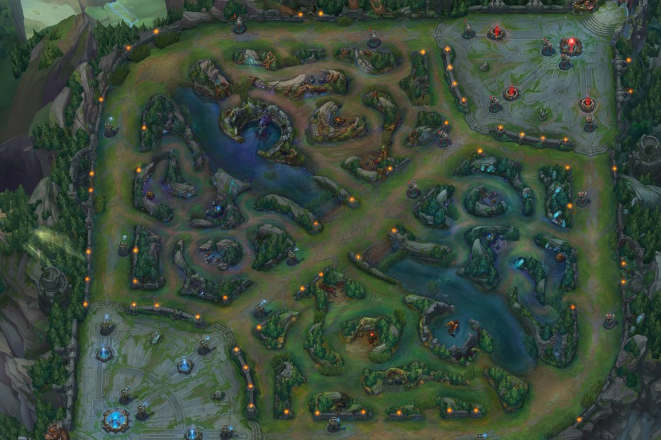

# Competitive League of Legends Game Winner Prediction

## Introduction

LoL is an online, 5 vs. 5 competitive PC game. It is one of - if not the most - popular game currently around. Despite that LoL has surprisingly little mainstream coverage, which is most likely due to its complexity - it’s not an easy game to understand.

LoL has a professional league. The top prize for the best team is over five million dollars and the average player makes a six-figure income. This data set aggregates basic statistics for every game since 2015 across all the professional leagues other than China.

## Datasets

We have an available dataset on kaggle for model training, the dataset includes competitive matches from 2015 to 2017. The matches include the NALCS, EULCS, LCK, LMS, and CBLoL leagues as well as the World Championship and Mid-Season Invitational tournaments :
- https://www.kaggle.com/datasets/chuckephron/leagueoflegends?resource=download

Riot games also provides an API from which we can fetch more actual data :
- https://developer.riotgames.com/apis

## Objectives

Predicting competitive match winner.

Biggest objective would be to be able to update the probability of winning based on the game progression :
- Ban phase - Champion select
- First blood - First tower - First neutral objective
- Gold diff - Kills diff

Useful link -> https://www.kaggle.com/discussions/general/330263
